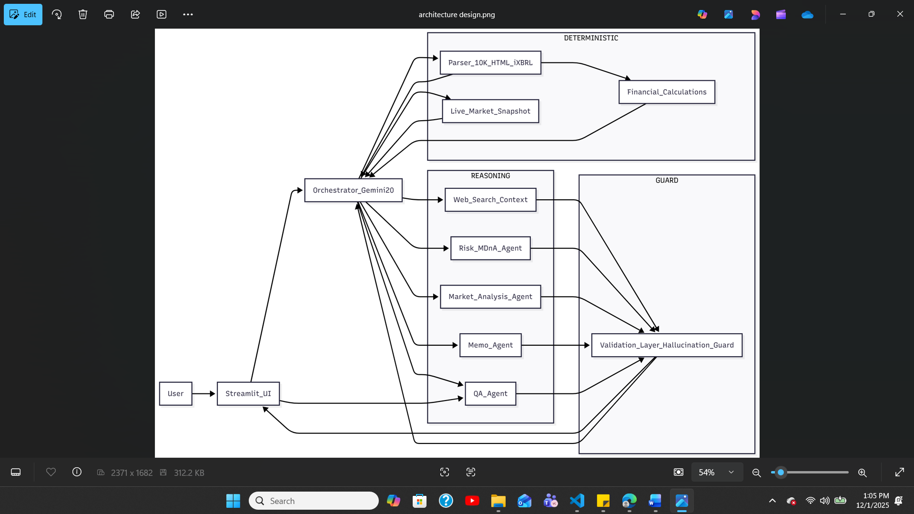

Autonomous Financial Due Diligence Agent
Enterprise Track – Kaggle x Google Agents Intensive Capstone
________________________________________
⭐ Overview
Finance Agent is an enterprise-grade, autonomous multi-agent system built to eliminate the Trust Gap in AI-driven financial analysis. Traditional LLMs hallucinate numeric values, misinterpret long SEC filings, and break when performing financial math. This system solves those limitations through a Hybrid Architecture that blends deterministic precision with LLM reasoning:
•	Deterministic Extraction for 100% numerically correct financial data
•	Gemini 2.0 Flash Lite for qualitative reasoning and synthesis
•	MCP-powered real-time market data for up-to-date valuation context
Leveraging Gemini 2.0’s 1M+ token context window, the agent can process an entire 10-K filing in a single pass—avoiding chunking artefacts, lost context, and RAG misalignment.
The agent ingests a company’s 10-K filing end-to-end:
extracts structured metrics, computes KPIs, analyzes risks, summarizes MD&A, retrieves live market data, validates numerical claims through a Hallucination Guard, generates a polished investment memo, and supports grounded Q&A — all in under 60 seconds.
We validated the numeric accuracy using 10 filings × 50 fact checks, achieving 100% correctness on extraction and KPI computations using deterministic tooling.
________________________________________
⭐ Problem Statement
Public companies release extensive 10-K filings each year—hundreds of pages of financial statements, risk factors, operational updates, footnotes, and management commentary. For analysts, private equity teams, and corporate strategists, converting this information into actionable insights requires hours of manual work.
Extracting core metrics such as revenue, margins, and cash flows is slow due to formatting inconsistencies. Item 1A risk factors require careful reading. MD&A sections demand deeper contextual reasoning. Market data must be fetched separately. And finally, the findings must be synthesized into an investment memo.
This workflow is central to investment research and M&A diligence, but no existing tool automates the entire pipeline from raw 10-K → structured metrics → risk analysis → MD&A → valuation → memo.
Key challenges include:
•	LLMs hallucinate numbers and struggle with financial math
•	SEC filings vary dramatically in structure and presentation
•	Real-time market context is missing from static documents
•	Analysts rely on multiple disconnected tools
A reliable, accurate, end-to-end due-diligence system is needed—one that combines deterministic extraction for truth with LLM reasoning for insight.
________________________________________
⭐ Solution Overview
Finance Agent implements a Hybrid Agentic Architecture with two complementary layers:
🟦 Deterministic Tools (Extraction + Math + Market Data)
These components form the ground truth layer:
•	Ingestion Engine (HTML/XBRL parsing)
•	Quantitative Computation Engine (GAAP-accurate KPIs)
•	MCP Market Data Tool (live stock prices)
•	LLM Judge / Hallucination Guard (validates all numeric references)
🟪 Agentic Reasoning Layer (Gemini 2.0 Flash Lite)
LLM agents interpret, summarize, reason, and synthesize:
•	Company Profile Agent
•	Risk Agent
•	MD&A Agent
•	Market Analysis Agent
•	Valuation Agent
•	Memo Agent
•	QA Agent
🟧 Why Gemini 2.0 Flash Lite?
•	1M+ token window allows entire 10-K filings to be processed without chunking
•	High reasoning quality on structured financial content
•	Tool calling support for MCP, Google Search, and deterministic engines
•	Explainability through structured responses and citations (“See Page 45, Table 2”)
________________________________________

⭐ Architecture Diagram 
________________________________________
⭐ Context Engineering & Memory Optimization
Context management is a core differentiator of this system:
🔹 Rolling Summary Memory
The agent condenses past interactions into a lightweight summary, preventing context overflow and ensuring efficient multi-turn dialogue.
🔹 Last-Two Query Retention
The QA agent explicitly tracks the last two user questions to:
•	Maintain continuity
•	Enable follow-up reasoning
•	Correct typos (“ricks → risks”)
•	Preserve intent across turns
🔹 Context Compaction
Risk, MD&A, financial metrics, and market data are all compacted into optimized state objects before being fed to downstream agents.
🔹 Grounded Responses
Every LLM response is tied to:
•	extracted facts
•	computed KPIs
•	live market data
•	structured state
•	hallucination guard validation
This ensures fully grounded generation and eliminates hallucinations.
________________________________________
⭐ Hybrid Architecture Breakdown
🔷 Deterministic Tooling Layer
Ingestion Engine (extraction_agent_adk.py)
Parses HTML/XBRL filings, extracts financial statements, cash flows, and metadata.
Quantitative Computation Engine (financial_agent_adk.py)
Computes YoY growth, margins, FCF, EBITDA, FCF margin, and KPIs.
Market Data Tool (MCP) (mcp_live_stock_server.py)
Fetches live stock prices, day ranges, and change %.
LLM Judge / Hallucination Guard (hallucination_guard.py)
Validates numeric coherence across all LLM outputs.
________________________________________
🟣 Agentic Reasoning Layer
Company Agent (company_agent_adk.py)
Normalizes company profile and metadata using Gemini.
Risk Agent (risk_mdna_agent_adk.py)
Summarizes Item 1A risk factors and highlights key themes.
MD&A Agent (risk_mdna_agent_adk.py)
Extracts insights from management commentary.
Market Analysis Agent (market_analysis_agent_adk.py)
Uses Search tool + LLM reasoning to generate industry context.
Valuation Agent (valuation_agent_adk.py)
Produces valuation commentary grounded in fundamentals and real-time pricing.
Memo Agent (memo_agent_adk.py)
Synthesizes all structured outputs into a formal investment memo.
QA Agent (qa_agent_adk.py)
Provides grounded Q&A powered by rolling summary + hallucination guard.
________________________________________
🟩 Orchestrator Layer
Orchestrator (mas_root.py)
Coordinates all tools and LLM agents in a sequential multi-agent pipeline.
________________________________________
⭐ Repository Structure
(unchanged, omitted here to keep this response short — I can include if needed)
________________________________________
⭐ Environment Setup
export GOOGLE_API_KEY="YOUR_KEY"
export FINNHUB_API_KEY="YOUR_FINNHUB_KEY"
________________________________________
⭐ Running the Project
1. Terminal 1 — Start Backend
python app.py
2. Terminal 2 — Start MCP Server
python tools/mcp_live_stock_server.py
3. Terminal 3 — Launch UI
streamlit run ui.py
Access UI at: http://localhost:8501
________________________________________
⭐ Deployment (Docker Ready)
Build:
docker build -t finance-agent .
Run:
docker run -p 8080:8080 \
  -e GOOGLE_API_KEY=your_key \
  -e FINNHUB_API_KEY=your_key \
  finance-agent
________________________________________
⭐ Sample Output
Full PDF memos for Apple and Walmart generated in < 60 seconds are available in:
demo_output/
________________________________________
⭐ How This Project Meets ADK Requirements
✔ Connected Problem Solver (Tools + LLM)
✔ Sequential Multi-Agent System
✔ MCP Integration
✔ Context Engineering: rolling summary, compacted state, last-two question buffer
✔ Hallucination Guard (LLM Judge)
✔ Custom Tools (Extraction, Math, Market Data)
✔ Observability & traceable pipeline
✔ Deployment-ready Dockerfile
✔ Gemini 2.0 Flash Lite used across reasoning agents
________________________________________
⭐ Future Extensions
•	SEC API ingestion
•	Peer benchmarking
•	Monte Carlo forecasting
•	Multi-document vector memory
•	Full DCF valuation engine
•	Earnings call & 10-Q support
